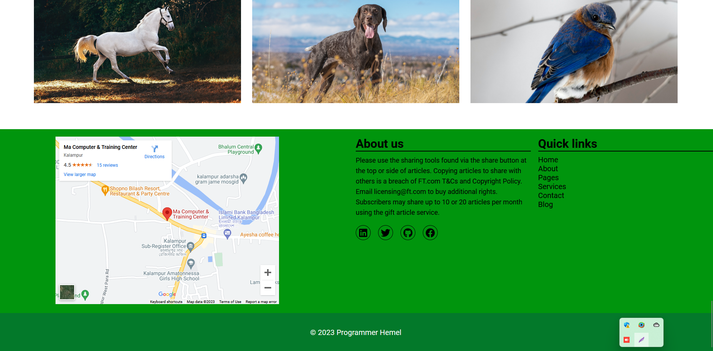

# Website
First Website,
That is a pattern followed by an attributes list, separated by whitespaces. Leading and trailing whitespaces are ignored. Lines that begin with # are ignored. Patterns that begin with a double quote are quoted in C style.
When the pattern matches the path in question, the attributes listed on the line are given to the path.

## Website Link
`file:///F:/Web/index.html`

## Website Images

